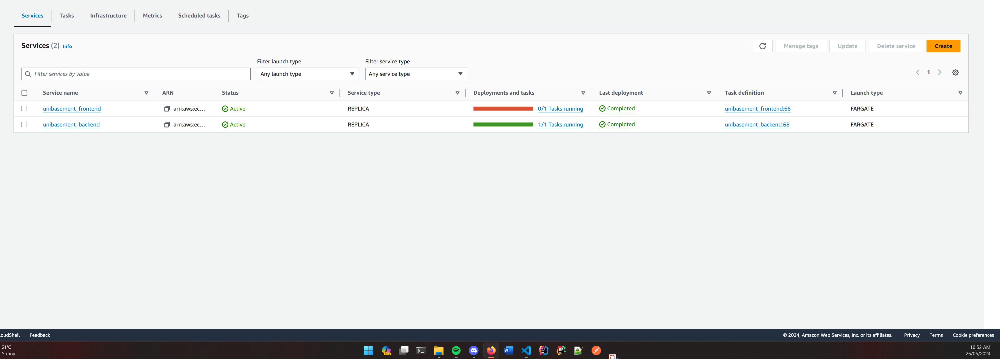

# Manual Testing of the Application

## Availability Tests

### Test Plans

#### Frontend Availability

1. Run Deploy workflow. [Deploy Documentation](DEPLOY_TEARDOWN.MD)
2. Visit AWS management console
3. Visit ECS and open the cluster for unibasement 
4. Select unibasement_frontend
5. Select tasks tab
6. Click the running task 
7. Note the current time 
8. Press Stop on the task
9. Return to the cluster view and refresh the page 
10. Refresh the view and note the time when the task returns to steady state
11. The task should return to steady state within 5 minutes 

#### Backend Availability

1. Run Deploy workflow. [Deploy Documentation](DEPLOY_TEARDOWN.MD)
2. Visit AWS management console
3. Visit ECS and open the cluster for unibasement 
4. Select unibasement_backend
5. Select tasks tab
6. Click the running task
7. Note the current time 
8. Press Stop on the task
9. Return to the cluster view and refresh the page
10. Refresh the view and note the time when the task returns to steady state
11. The task should return to steady state within 5 minutes 
