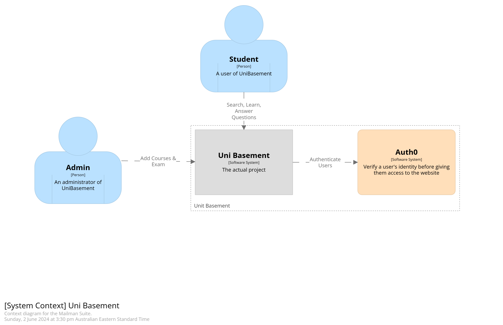
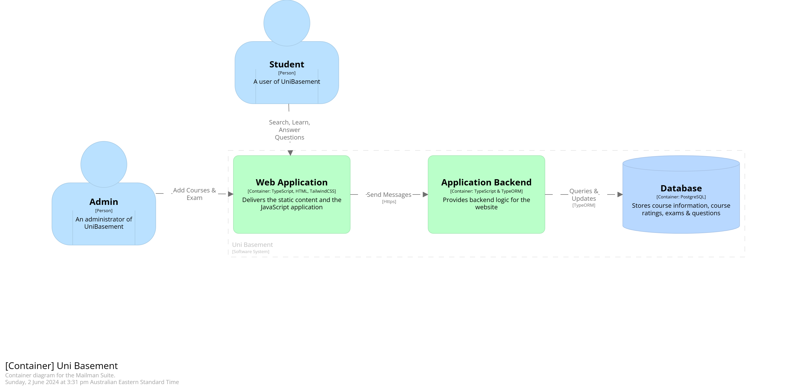

# UniBasement

Our application is deployed (most likely) and can be seen [here](http://unibasement.g6.csse6400.xyz/).  
Link to the original project proposal [UniBasement](https://github.com/CSSE6400/project-proposal-2024/blob/main/s4702098/proposal.md)

## Abstract

This report covers the design decisions made and changes made for the delivery of UniBasement's MVP. UniBasement is a platform designed to empower students to develop and share educational content, by collaboratively working on questions together. It allows students to post questions, answers, comments and vote on other solutions. To develop an MVP for this, we looked into multiple different software architectures and eventually choose a layered architecture as it was best suited for our project and its Non Functional Requirements. The architecture allowed for separation and isolation of functionality and allowed the system to be maintainable, reliable and available. In this report we also cover the critique and tradeoffs of our implementation and provide test plans plus results to support our findings. Finally, we reflect on the project and discuss what we would do differently if we were to start again.

## Changes

Throughout the project there were required changes compared to what was outlined in the proposal due to limitations in time as well as to better adhere to the quality attributes we aimed to achieve.

### Accounts

In the project proposal it was outlined that the users should be able to create an account and register their university affiliation. However, due to time constraints we were forced to cut out the university affiliation and centre the project around University of Queensland students.

The team had also realised that allowing users to sign up would require us to handle the variety of security risks it would introduce such as storing user login data. Therefore, we decided to use AUTH0 to handle the login using external accounts such as Gmail or GitHub. This however, had the unintended affect that it removed our ability to allow users to update the account information or profile picture as that it was handled by AUTH0. The decision to use AUTH0 was made after careful consideration of its security practices and its effect on the project, and is detailed further in [ADR001](../model/adrs/ADR001_AUTHENTICATION.md).

### Success criteria

The project proposal had many ambiguities and untestable success criteria. An example of this is "99% uptime over a measured period," however the proposal does not specifically quantify the minimum measured time. To better define the success criteria we made clarifications on the ambiguous ones, this can be seen below.

| Old | New |
|-------|---------|
| Over 99% uptime over a measured period | Over 99% uptime over a 2 day span with the checks happening to both frontend and backend in 5 minute intervals  |
| All core functionality tested   | 100% of backend functions should have their main functionality tested (i.e. 200/201 response).  e2e testing should cover base use cases of logging in, creating course, exam, question and a comment.  |

## Architecture Options

There were a few architectures that were considered when planning on how to tackle this project. The first architecture that we considered was a micro-services architecture. The allure of this architecture was the partitioning of services (e.g. Courses, Exams, etc.) to achieve modularisation ensuring that each service is independent of each other. The partitioning of services would have also enabled our team to develop in our most comfortable languages. Each service could be written with a different coding language eliminating the need for a few developers to learn a new language / technology. The improved fault isolation would have also been a benefit as if there were to be an issue in one service it would not affect the other services. Finally, although scalability was not one of the primary quality attributes, the microservices architecture would have allowed us to scale each service independently as demand increased or decreased.

There were also some downsides that were discovered when evaluating if the microservices architecture was the right fit for our project. The overall complexity of our project would have increased as we would have needed to handle the communication between services and then would have to deal with the latency of our API calls increasing. Secondly, deploying our application to Amazon Web Services (AWS) would have increased in complexity as we would need to handle each service/ container deploying correctly. Thirdly, testing in a microservices architecture would require each dependent service to be confirmed working before having the any e2e tests run. Finally, taking into account the scale of our project and the scope that we are aiming to deliver, the microservices architecture felt like overkill and with time constraints not that feasible to implement.

The other architecture that was considered was a Monolithic Architecture. The simplicity of development in this architecture was its main positive aspect, as it would have enabled us to quickly develop the project which was very important in our short timeframe. The second drawing point was ease of deployment, as the monolithic app would of been contained in one container, the deployment and maintaining of the app would have been easy. Finally, a monolith would have made system and integration testing easier as the end-to-end tests would have run a single application which also leads to easier debugging.

However, there were a few downsides of using the Monolithic architecture which led us to not use it. Primarily, the larger our application grew the more complex it would become to understand, which would negatively affect maintainability. Adding or upgrading functionality would be become difficult as it might cause unexpected side effects. The coupling of services into a monolith would have led to greater dependency between different services making identifying the cause of issues much higher. Finally, to scale our application and ensure availability, it would require the application replicated on multiple servers which would have increased costs compared to other architectures. Due to all these reasons we came to the conclusion that the Monolithic Architecture would not be suitable for our project as it does not aid in trying to achieve the quality attributes we had set.

## Architecture

To enable UniBasement to meet the described architecturally significant requirements, a layered architecture comprised of four layers was implemented. The highest layer was the Presentation Layer, which was comprised of our front-end, built with Next.js using Tailwind. These technologies were chosen as they are industry standard which enables easier contribution. Components within the front-end were designed to be generic and extensible where possible whilst maintaining a maximum of 300 lines to minimise complexity. Unit tests were implemented through the integration tests to ensure that functionality was as expected. The business layer was implemented to handle the application logic, business rules, and  objectives; it handles the logic and enables the functionality of the application. This was implemented within Node.js and tested through Jest which are both industry standard. The Persistence Layer manages requests and interacts with the database (DB). Through the use of TypeORM, the developer experience is enhanced whilst adding a protective barrier for the DB. By abstracting the DB interactions, the DB technology is interchangeable and it also streamlines development. The DB Layer was implemented via PostgreSQL as it’s an industry-standard relational DB management system (RDBMS). PostgreSQL ensures data security and provides robust features for managing data. However, because of the use of an ORM in the Persistence Layer, the DB Layer can easily be changed to any other RDBMS if necessary with little impact on development or the product.

UniBasement  architecture and implementation was designed to achieve the architecturally significant requirements: maintainability, availability and reliability. To meet our success criteria for maintainability we focussed on utilising industry standards and following best practices. UniBasement features dev tools (e.g. workflows for testing) and features documentation covering many different aspects. An example of these aspects include how to contribute, how to deploy the application and how to test. Additionally UniBasements implementation of a layered architecture allows for a highly available system as the frontend and backend features autoscaling groups which can recover and reconnect themselves appropriately. This ensures the system maintains a high % uptime and needs no human intervention to be redeployed. Reliability has been ensured through the implementation of thorough integration and e2e testing and the use of an ORM to provide abstraction.

This architecture additionally, affected the design decisions regarding the implementation of UniBasement. To implement the layered architecture correctly, it was necessary to implement the layer isolation principle. This requires that the layers should not depend on implementation details of another layer [3]. Our implementation of UniBasement used this concept as we used layers of abstraction within the frontend and backend. Our use of TypeORM abstracted any implementation details for the DB and our implementation of the frontend through our custom react hooks and http routing removes any implementation details of the backend. Additionally, our structure of the layers ensured that UniBasement would only communicate across layers through the neighbouring layers which maintains the neighbour Communication Principle [3]. UniBasement, also, has a higher layer depend on a lower layer, and the layers only communicate through general interfaces, callbacks and events, thus, maintaining the downward dependency principle and the upward notification principle [3]. As demonstrated, all layered architecture principles were maintained in UniBasement's implementation.

## Critique & Tradeoffs

When analysing the choices made throughout the project some sacrifices and tradeoffs had to be made. To accurately critique UniBasement's architecturally significant decisions, it is important to consider both functional and non-functional requirements. Each of these will be assessed individually.

### Functional Requirements

Overall the project has successfully met all functionality described in the project proposal when considering the changes made in the [Changes](#changes) section. This includes the functionality to create courses, exams, questions, answers, upvote and downvote. To allow for strict permissions on who can create a course, it was decided to implement Auth0 to handle user authentication ([ADR001](../model/adrs/ADR001_AUTHENTICATION.md)) and implement user roles ([ADR005](../model/adrs/ADR005_USER_ROLES.md)). The implementation of these two features works together to ensure the security of the system and to ensure only authorised users can make changes. This also allows us to enforce allowing only the user who created content to edit it, preventing malicious actors. The use of user roles also allows us to enforce only administrators having extended permissions to create courses and exams. The implementation of these features was successful which met and exceeded the requirements set out in the project proposal. 

Using Auth0 had its tradeoffs, however. Due to its integration into the frontend it increased the complexity of both running the frontend locally and the e2e tests. Because of this, a developer needs an Auth0 tenant setup and running so that they can develop locally. This is a tradeoff as it restricts developers to have a stable internet connection while developing locally, and also depends on an external service being available. It also increased the complexity of the e2e tests, as the majority of our system requires the user to be logged in. To get around this we implemented a test account in a development Auth0 tenant that the playwright system could login with to ensure proper e2e tests were still conducted. Although implementing user authentication via Auth0 had these tradeoffs, it does greatly increase the security of our system and hence was worth implementing. 

Users have the ability to add both text and images to a question and answer. This raises the concern of inappropriate, malicious, or illegal text or images. This was not determined to be within the scope of the minimum viable product and would have added unnecessary complexity to the UniBasement prototype. It was therefore not implemented, however would be a consideration for any future work of the project. One other aspect not implemented was Universities other than UQ. This was also determined to be out of the scope of the MVP, as we did not have access to any courses or examinable content from other universities. However, implementations of other universities was considered in the DB structure with support for assigning courses to a university. This would allow for easy implementation of other universities in the future.

Overall our architecture allowed us to deliver all the functionality of the MVP and exceed it in some areas. The choice of a layered architecture allowed us to easily implement this functionality rapidly and with minimal complexity.

### Non-Functional Requirements

During the early stages of development we were highly coupled with Postgres, as our backend service relied on specific Postgres features. After our initial backend service was developed we quickly identified this as impacting the maintainability and reliability of our system. To reduce our reliance on a specific implementation of SQL we decided to use an ORM as a persistence layer between the DB and the backend so that we could abstract out SQL queries. This change and implementation is covered in [ADR002](../model/adrs/ADR002_ORM.md). By introducing TypeORM we added a persistence layer into our architecture. This enabled us to be less reliant on Postgres and increase our maintainability and reliability. Alongside this change we also decided to make our backend codebase more maintainable.

To do so, we introduced a change from a single file for all routes, to multiple files for each route category. This was a change to our implementation of the architecture, and it increased the maintainability of our system. More detail can be found in [ADR003](../model/adrs/ADR003_ROUTES.md). This improvement was made to allow developers to easily find the functionality they are looking for as they are all grouped together in logical files. It also meant that any changes to the API endpoints themselves in Express were easier to implement since the route logic is separated out from where the Express router is created.

As part of our reliability quality attribute we decided to change our integration tests. Originally the integration tests would send requests to the backend service and just confirmed the received HTTP response code and body were as expected. To increase the reliability of our project it was decided to implement [ADR004](../model/adrs/ADR004_INTEGRATION_TESTS_WITH_DB.md). ADDR004 covers the change to connect the test container directly to the DB. By doing this we were able to verify the changes were indeed made to the DB and to validate what the backend service was doing. This greatly increased the reliability of our project.

To ensure UniBasement is available, we implemented an AWS autoscaling group on both the frontend and backend which allows for the recovery of services if they go down. Also, during initial deployment testing, we noticed that if one service went down the IP address for the service would change. This resulted in the frontend and backend services no longer being connected together, since the backend API address was passed in as an environment variable to the frontend image. To fix this we implemented [ADR006](../model/adrs/ADR006_LOAD_BALANCERS.md) where a load balancer was placed between both user and frontend and between the frontend and backend service. The main change here was the implementation of a load balancer between the frontend and backend services. This allows for the frontend to not need to be recreated (to pass the backend API url) if the backend service went down. This increased the availability of our system, as the AWS autoscaling groups handle recovery of each service task and the entire system is only impacted for ~5 minutes overall while a new task is spinning up. 

By using a layered architecture we ensured the availability of each service independently and scaled each part independently. The tradeoff for this is that it may not be as scalable as a microservices architecture. However, for the size of our project, the scope it encompassed, and the given time constraints, a layered architecture was actually more appropriate. The current backend functionality being split into many smaller services would be overkill since there is simply not enough functionality there to justify having individual services. Overall, our use of the layered architecture ensured the availability, maintainability and reliability of our system.

## Evaluation & Testing

### Availability

Amazon Web Services (AWS) was used to deploy our application and ensure its availability. To manage website traffic, we implemented a load balancer to improve fault tolerance. This load balancer can automatically detect server issues and reroute traffic to operational servers. Furthermore, we dynamically scale resources based on load, effectively handling peak usage times. Using autoscaling groups we ensure that a minimum of 1 service is always running for both the frontend and backend. If an error were to occur and a service to go down, the autoscaling group can recover the service. The Layered Architecture allows us to address and resolve downtime issues in one layer without disrupting the others.

To ensure the availability of our website, we conducted rigorous manual testing. To test the availability of our system we ran simulated scenarios where certain containers were killed in AWS. We tested the system's availability and ability to recover from this and still maintain functionality. From these tests, we found that the system was able to recover and maintain functionality in less than 5 minutes every time a container was killed. The test plan showing the steps taken and the result are documented and can be found in [MANUAL.md](../docs/MANUAL.md). We also created k6 tests to programmatically check the frontend and backend services across 2 days to log and calculate the uptime percentage. The k6 tests ran every 5 minutes, and over the 2 days found that the uptime was 99.5%. The only downtime was a 15-minute interval in the middle of the night. Further documentation and results of this can be found [here](../docs/AVALIABILITY_TEST.md).

Although our frontend and backend were tested extensively and held up to testing, one area of potential failure is the DB. We did not implement any DB replication, therefore if the DB goes down or gets destroyed, there is no recovery. Unfortunately due to time constraints we were unable to implement this and a load balancer in front of the DB. However, the extended k6 we did showed that the DB maintained uptime alongside the frontend and backend services.

In terms of the outlined success criteria from the proposal, and the ones we redefined in an [earlier section](#changes), we passed the tests extremely well.

### Reliability

There were numerous techniques employed to achieve the high level of reliability that we had set at project conception. In the project proposal it was outlined to achieve the necessary level of reliability, the project should have unit tests that thoroughly covers the core functionality of the system.

The repo goes beyond this and features 3 types of programmatic tests to verify functionality and achieve the reliability QA.

1. Basic unit testing
2. Integration testing - persistence & database layers
3. End to end (e2e) testing - all application layers

The basic unit testing only checks functionality of data transformation functions within the backend with no reliance on a DB or the backend server being spun up. It ensures that these functions correctly transform their input into an expected output.

The integration testing checks the backend routing functionality with a DB connection. These tests are made in pytest and are designed to be fully maintainable and complete in terms of coverage, with support to extend with new tests in the future. Tests are divided into different files based on the route they are testing to ensure maintainability. The tests which cover base functionality (all tests excluding full suite) verify the DB before executing the route. Then they send the request, verify the response and response code, and finally verify the changes made by directly communicating with the DB through SQLAlchemy reflection. By integrating the tests with the DB, we are able to verify the changes made by the application and ensure its success in achieving functionality.

The full suite tests are designed to test the persistence and database layers in more real world scenarios and ensures the backend is functioning as expected. Specifically, it ensures that executing typical user request scenarios one after the other will not break the data or its persistence. At every step in the scenario, the DB state is verified to ensure expected functionality.

The e2e testing is written in playwright and is designed to cover all elements of the layered architecture, including any functionality provided by external dependencies such as Auth0. It requires the development application to be running (i.e. frontend, backend & DB), and tests all the core functionality users would be interacting with. This includes logging in and out as both an admin or regular user role, adding courses or exams as an admin, viewing courses and exams, adding questions, and adding and interacting with comments.

The tests are designed to be easily run by developers either locally or through automated workflows. They work by spinning up 3 containers (backend, DB and the container running the tests). These containers are defined inside the "docker-compose.yml" file located inside the "integration_tests" directory. Currently, they are set to run in the GitHub Actions on every push or PR to the main branch. However, developers can manually run the action as well by selecting run workflow and selecting the branch they want tested. The tests in GitHub Actions are run in parallel to speed up the process. Another important note is that the DB must be cleared to ensure that no persistent data is left over between test runs. This is automated as part of the `test.sh` script inside the integration test folder. When the tests are run, at the end it provides a short overview on how many tests passed and failed.

The full e2e test currently can only be run locally due to its reliance on Auth0. Since we do not have access to repository secrets, there is no secure way of storing the necessary Auth0 credentials. They have therefore been excluded from the test Dockerfile and must be run manually using `pytest frontend/test_full_e2e.py` once a development application environment is running. Ideally, once Auth0 credentials can be placed in a GitHub secret and the e2e test added back to the Actions workflow, a PlayWright video artefact could also be saved on workflow run completion in order to view the outcomes of the e2e testing in GitHub Actions.

More detailed documentation on testing including how to extend the test suites can be found in [TESTS.md](../docs/TESTS.md). Actual results for the tests can be viewed in GitHub Actions by selecting the Test workflow. Here you can see both the unit and integration tests being run on and the results of these.

By deploying our application to Amazon Web Services, we remove the necessity to ensure the webservers running our application are working correctly. Through the shared responsibility model, AWS is responsible for the infrastructure such as the hardware, software and networking that run AWS Cloud services. We then use terraform to ensure the containers we deploy are reliable on AWS.

Since we have tested all normal / base cases and a large majority of side cases, we successfully passed the outlined [success criteria](#changes) in the sections above. This helps guarantee that all code will function under almost all circumstances.

#### Maintainability

Maintainability has been achieved primarily by the abstraction of code and layers as well as the extensive documentation of developer setups and tooling. In the backend we have separated the functionality behind the endpoints in their own files and services to allow for easier maintainability. This also allows us to easily improve our architecture in the future by converting to a microservices architecture for better long-term maintainability. We have separated out the frontend, backend and DB into three independent containers that communicate with each other through highly documented API calls over HTTPS, as seen in the documentation in [API.md](../docs/API.md). The DB schema is also documented in [DATABASE.md](../docs/DATABASE.md) to detail what tables and relationships are available. This allows for future developers to understand the DB structure, and combined with the use of TypeORM, easily extend it when necessary.

Development, testing, and deployment all make use of standard developer tools to allow new contributors to quickly setup their environments. We include Dockerfiles and docker-compose files to spin up all layers of the application, with specific instructions included the READMEs present in the [root folder](../README.md), [frontend folder](../frontend/README.md), and [backend folder](../backend/README.md). The tests also make use of Docker to ensure that the environment is consistent and that the tests can be run in a CI/CD pipeline. They also include extensive documentation in [TESTS.md](../docs/TESTS.md). For deployment, Terraform was used to ensure the exact deployment setup can be replicated every time. For ease of use, GitHub Actions have also been setup for deployment, teardown and redeployment, with further documentation in [DEPLOY_TEARDOWN.md](../docs/DEPLOY_TEARDOWN.md). 

We also made the effort to use the same programming language for both the frontend and backend. This acts as a redundancy that even if our documentation is unable to effectively communicate our decisions or is no longer update, developers should be easily able to read the codebase and understand the importance and inner working of each component of the system. Using typescript as the chosen language also allows the sharing of types between the frontend and backend, which minimises errors in communication between the two layers.

Because of the extensive documentation and the use of industry standard tools, we have successfully met the outlined [success criteria](#changes) in the sections above. This ensures that the codebase is maintainable and can be easily extended in the future.

### Security

The software effectively achieves its desired quality attributes, however the implementation also supports the security of the application. The layered architecture inherently provides isolation, which means that if one layer is compromised, the other layers remain unaffected. This architecture also offers flexibility, allowing us to enforce separate security policies for each layer, thereby reducing the risk of unauthorized access that could compromise the system or data.

The choice of using Auth0 means we take advantage of an industry standard authentication provider to handle security of user accounts. User IDs are checked at all layers of the application, with the frontend checking authentication before sending API requests, the backend checking user IDs in each request against the user records, and finally the DB keeping track of user IDs registered in the system. 

In addition to the aforementioned security measures, we have implemented an extra layer of protection specifically for requests related to the creation of courses and exams. This additional security layer restricts access exclusively to users with administrator roles, ensuring that malicious actors cannot add bad courses. This could however be improved by moving the role handling into Auth0's user metadata features.

## Reflection

Over the course of this project we, the Evan Hughes Fanclub learnt many things. The key things we learnt or would have done differently can be seen below:

- The importance of planning and starting early. We found that the earlier we started the project the more time we had to implement features and the more time we had to test. This was crucial in ensuring that we met our success criteria and delivered a high quality MVP.
- Automation benefits, by setting up workflows for testing and deployments early, we enhanced the developer experience and was able to catch bugs/ errors early. This helped pinpoint any issues early and allowed us to fix them before they became a larger issue.
- Db replication. This was something we wanted to implement but unfortunately due to time constraints we had to shift our focus to the creation of the report and video. By implementing a load balancer in front of the DB and implementing DB replication we could have enhanced our availability and reliability.
- We discovered NextAuth.js after we implemented Auth0 into our application. Had we properly explored all solutions we would have discovered NextAuth.js and its benefits. It would have been a more seamless integration into our application as we use Next.js. This would have saved us many hours of trouble shooting and trying to get Auth0 working. Through this we learnt the importance of reviewing all options before committing resources heavily into a solution.
- Currently our implementation handles user roles. If we were to do this project again we would have utilised Auth0's metadata for users to handle roles. This would have been a more secure and easier to implement solution. This would have also allowed us to easily change roles and permissions for users without having to change the DB schema.
- We would have also implemented automated generated API documentation. This would have enabled highly maintainable documentation that would not need manual intervention / updating.
- Using terraform state file in an s3 bucket on AWS allowed us to easily and safely share the state file to ensure that no conflicts occur. This was a great benefit to our development process.
- The use of extensive integration tests allowed us to capture any errors made. This was evident when our backend was split into multiple folders and ensuring everything was still functioning as expected. The integration tests also helped capture any errors with DB schema changes that broke the DB early.

Overall we feel our project was a great success, and the key factor behind this was that we started early and always kept the project moving forward. Although we were a person short we still delivered a high quality MVP that met all the success criteria we set out to achieve.

## References

[1] J. Nemer, “Advantages and Disadvantages of Microservices Architecture,” cloudacademy.com, Nov. 13, 2019. https://cloudacademy.com/blog/microservices-architecture-challenge-advantage-drawback/
[2] “What is Load Balancing? - Load Balancing Algorithm Explained - AWS,” Amazon Web Services, Inc. https://aws.amazon.com/what-is/load-balancing/#:~:text=Load%20balancers%20improve%20application%20performance
[3] R. Thomas, B. Webb, "Layered Architecture", Feb. 19, 2024. https://csse6400.uqcloud.net/handouts/layered.pdf 
