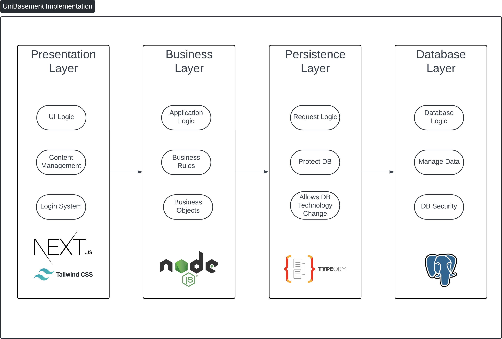

# UniBasement

## Abstract

This report covers the design decisions made and changes made for the delivery of UniBasement's MVP. UniBasement is a platform designed to empower students to develop and share educational content, by collaboratively working on questions together. It allows students to post questions, answers, comments and vote on other solutions. To develop an MVP for this, we looked into multiple different software architectures and eventually choose a layered architecture as it was best suited for our project and its Non Functional Requirements. The architecture allowed for separation and isolation of functionality and allowed the system to be maintainable, reliable and available. In this report we also cover the critique and tradeoffs of our implementation and provide test plans plus results to support our findings. Finally, we reflect on the project and discuss what we would do differently if we were to start again.

## Changes

Throughout the project there were required changes compared to what was outlined in the proposal due to limitations in time as well as to better adhere to the quality attributes we aimed to achieve.

### Accounts

In the project proposal it was outlined that the users should be able to create an account and register their university affiliation. However, due to time constraints we were forced to cut out the university affiliation and centre the project around University of Queensland students.

The team had also realised that allowing users to sign up would require us to handle the variety of security risks it would introduce such as storing user login data. Therefore, we decided to use AUTH0 to handle the login using external accounts such as Gmail or GitHub. This however, had the unintended affect that it removed our ability to allow users to update the account information or profile picture as that it was handled by AUTH0. The decision to use AUTH0 was made after careful consideration of its security practices and its effect on the project, and is detailed further in [ADR001](../model/adrs/ADR001_AUTHENTICATION.md).

### Success criteria

The project proposal had many ambiguities and untestable success criteria. An example of this is "99% uptime over a measured period," however the proposal does not specifically quantify the minimum measured time. To better define the success criteria we made clarifications on the ambiguous ones, this can be seen below.

| Old | New |
|-------|---------|
| Over 99% uptime over a measured period | Over 99% uptime over a 2 day span with the checks happening to both frontend and backend in 5 minute intervals  |
| All core functionality tested   | 100% of backend functions should have their main functionality tested (i.e. 200/201 response).  e2e testing should cover base use cases of logging in, creating course, exam, question and a comment.  |

## Architecture Options

There were a few architectures that were considered when planning on how to tackle this project. The first architecture that we considered was a micro-services architecture, the allure of this architecture was the partitioning of services to achieve modularisation ensuring that each service is independent of each other. The partitioning of services would have also enabled our team to develop in our most comfortable languages. Each service could be written with a different coding language eliminating the need for a few developers to learn a new language / technology. The improved fault isolation would have also been a benefit as if there were to be an issue in one service it would not affect the other services. Finally, although scalability was not one of the primary quality attributes, the microservices architecture would have allowed us to scale each service independently as demand increased or decreased.

There were also some downsides that were discovered when evaluating if the microservices architecture was the right fit for our project. The overall complexity of our project would have increased as we would have needed to handle the communication between services and then would have to deal with the latency of our API calls increasing. Secondly, deploying our application to Amazon Web Services (AWS) would have increased as we would need to handle each service/ container deploying correctly. Thirdly, testing in a microservices architecture would require each dependent service to be confirmed working before having the tests run. Finally, taking into account the scale of our project and the scope that we are aiming to deliver, the microservices architecture felt like overkill and with time constraints not that feasible to implement.

The other architecture that was considered was a Monolithic Architecture. The simplicity of development in this architecture was its main intriguing aspect, as it would have enabled us to quickly develop the project which was very important in our short timeframe. The second drawing point was ease of deployment, as the monolithic app would of been contained in one container, the deployment and maintaining of the app would have been easy. Finally, a monolith would have made system and integration testing easier as the end-to-end tests would have run a single application which also leads to easier debugging.

However, there were a few downsides of using the Monolithic architecture which led us to not use it. Primarily, the larger our application grew the more complex it would become to understand. Adding or upgrading functionality would be become difficult as it might cause unexpected side effects. The coupling of services into a monolith would have led to greater dependency between different services making identifying the cause of issues much higher. Finally, to scale our application it would require the application replicated on multiple servers which would have increased costs compared to other architectures. Due to all these reasons we came to the conclusion that the Monolithic Architecture would not be suitable for our project as it does not aid in trying to achieve the quality attributes we had set.

## Architecture

To enable UniBasement to meet the described architecturally significant requirements, a layered architecture comprised of four layers was implemented. The highest layer was the Presentation Layer, which was comprised of our front-end, built with Next.js using Tailwind. These technologies were chosen as they are industry standard which enables easier contribution. Components within the front-end were designed to be generic and extensible where possible whilst maintaining a maximum of 300 lines to minimise complexity. Unit tests were implemented through the integration tests to ensure that functionality was as expected. The business layer was implemented to handle the application logic, business rules, and  objectives; it handles the logic and enables the functionality of the application. This was implemented within Node.js and tested through Jest which are both industry standard. The Persistence Layer manages requests and interacts with the database (DB). Through the use of TypeORM, the developer experience is enhanced whilst adding a protective barrier for the DB. By abstracting the database interactions, the DB technology is interchangeable and it also streamlines development. The DB Layer was implemented via PostgreSQL as it’s an industry-standard relational database management system (RDBMS). PostgreSQL ensures data security and provides robust features for managing data. However, because of the use of an ORM in the Persistence Layer, the DB Layer can easily be changed to any other RDBMS if necessary with little impact on development or the product.

UniBasement  architecture and implementation was designed to achieve the architecturally significant requirements: maintainability, availability and reliability. To meet our success criteria for maintainability we focussed on utilising industry standards and following best practices. UniBasement features dev tools (e.g. workflows for testing) and features documentation covering many different aspects. An example of these aspects include how to contribute, how to deploy the application and how to test. Additionally UniBasements implementation of a layered architecture allows for a highly available system as the frontend and backend features autoscaling groups which can recover and reconnect themselves appropriately. This ensures the system maintains a high % uptime and needs no human intervention to be redeployed. Reliability has been ensured through the implementation of thorough integration and e2e testing and the use of an ORM to provide abstraction.

This architecture additionally, affected the design decisions regarding the implementation of UniBasement. To implement the layered architecture correctly, it was necessary to implement the layer isolation principle. This requires that the layers should not depend on implementation details of another layer (WEEK 1 LECTURE). Our implementation of UniBasement used this concept as we used layers of abstraction within the frontend and backend. Our use of TypeORM abstracted any implementation details for the database and our implementation of the frontend through our custom react hooks and http routing removes any implementation details of the backend. Additionally, our structure of the layers ensured that UniBasement would only communicate across layers through the neighbouring layers which maintains the neighbour Communication Principle (WEEK 1 LECTURE). UniBasement, also, has a higher layer depend on a lower layer, and the layers only communicate through general interfaces, callbacks and events, thus, maintaining the downward dependency principle and the upward notification principle (WEEK 1 LECTURE). Finally, a layered architecture requires UniBasement to maintain the Sidecar Spanning Principle, but as no sidecar layer was implemented this did not affect the implementation details. The layered architecture affected the implementation details of UniBasement and all layered architecture principles were maintained.

## Trade-Offs

Through the choice of the layered architecture, it detrimentally affected the scalability and integration testing. As UniBasement's implementation of the layered architecture relied on a monolithic backend, it naturally raises concerns regarding the scalability. When designing UniBasement, one of the primary concerns was the viability for the minimum viable product (MVP). Given that the deadline for the task was the limiting factor, it was important for the architecture to be simple, this came at the cost of scalability. A micro-services architecture could have scaled much more effective as opposed to the monolithic backend that UniBasement uses. This naturally will affect the scalability and the reliability of the application. Another aspect of UniBasement that was affected by the architecture choice was the integration testing. Due to the multiple layers of the architecture, it increased the complexity of the integration tests created. This added additional complexity and time required to complete the integration test. Whilst this was not a major concern, as one of the primary objectives was to deliver a product within a short period of time, this was a concern that was considered whilst determining the architecture UniBasement used. A layered architecture had two identified specific tradeoffs, scalability and affect to integration tests for UniBasement.

## Critique

To accurately critique UniBasement's architecturally decisions, it is important to consider both functional and non-functional requirements. Each of these will be assessed individually.

### Functional Requirements

The functional requirements of UniBasement were conclusively met, with only text or image validation not implemented, and selecting universities other than UQ not added. All functionality was implemented as outlined within the Proposal. This included the implementation of creating courses, exams, questions, and answers. Creating courses and exams was limited to higher access user to mitigate allowing any user to perform these actions as this would enable bad actors to potentially deface of harm UniBasement (i.e making hundreds of false courses would degrade search performance). Users have the ability to add both text and images to a question and answer. This raises the concern of inappropriate, malicious, or illegal text or images. This was not determined to be within the scope of the minimum viable product and would have added unnecessary complexity to the UniBasement prototype. One other aspect not implemented was Universities other than UQ. This was due to this being determined out of the scope of the minimum viable product, additionally, we did not have access to any courses or examinable content or other university emails. Implementations of other universities was considered in the database structure. The functional requirements were conclusively met, with text and image validation not implemented, and selecting universities other than UQ not added.

### Non-Functional Requirements

#### Availability

UniBasement's availability was affected by the monolithic backend, the monolithic backend which UniBasement used affects the availability as it increase the points of failure for the backend. A modular, microservice approach could have enabled a much more available backend as it would have limited failure to specific small portions of the application. To ensure our service is highly available a load balancer was utilised between the user and the frontend and also between the frontend and backend. This ensures that if a service dies the autoscaling group can automatically recover and connect everything without requiring the entire system to be teared down and deployed. This ensures we maintain a high availability. Finally, the lack of database replication and a load balancer here impacts the availability of UniBasement. This is because the database is a single point of failure which limits the entire application. A more available approach would have used replicas to enable database scaling to mitigate the affect of the main database being unavailable. The monolithic back-end, load-balancer in the front-end and back-end, and the database replication affected the availability of UniBasement. Overall, the combination of our architecture and its implementation has allowed us to deliver a highly available system that is also capable of recovering from failure.

#### Reliability

Throughout the development of the UniBasement MVP, the reliability of the application was affected by the use of auth0, unit testing, and the independent backend testing. The use of auth0, creates a key weakness for UniBasement, as it is an external service that would disable the entire functionality of UniBasement should it go down. Other libraries could have been used, but auth0 was implemented to enable rapid development. Whilst this may affect reliability, arguably, auth0 could be more reliable than a custom implemented solution for UniBasement. Additionally, unit testing was affected through the use of a single s3 bucket, and use of playwright frontend tests. The s3 bucket used to handle image uploads was necessary to run unit tests and hence, limits developer's ability to test image upload functionality. The use of playwright enabled thorough end to end testing. This enabled more thorough testing enhancing the maintainability of UniBasement. UniBasement's layered architecture benefits backend unit testing, as it allows the backend to be connected to our DB independently of our frontend. We can thus, validate the backend's functionality without any need to rely upon the frontend which a monolithic architecture may have required. This naturally enhances the reliability of UniBasement. UniBasement's reliability was affected by auth0, a singular s3 bucket, use of playwright frontend tests, and independent backend testing.

#### Maintainability

Maintainability of the project was affected by decisions made through the process of constructing the MVP. To enable quick and easy development of the prototype auth0 was used. Auth0 is an authentication library used to rapidly integrate authentication into an application, which is why it was initially used. As one of our primary objectives was to deliver an MVP, rapid development was necessary to meet the deadline. This affects the maintainability of the application as auth0 complicates the developer process as credentials are necessary for development locally. Whilst this does affect the developer experience, it is not abnormal or something that could have been mitigated other than committing a significant portion of time implementing another library or a custom solution. Additionally, due to the github environment not allowing the addition of secrets, the end to end tests were not able to be ran on commit or through github actions. Due to a lack of admin access to the repository, it was not possible to do this, although the tests can be run locally easily, it does slightly hurt our maintainability that we cannot automate the end to end testing. Another aspect that should have been implemented is the use of automated generated API documentation. This would enable highly maintainable documentation that is updated automatically. For this MVP it was decided that this was out of scope.

## Evaluation

### Testing

The repo features 3 types of tests to verify functionality and achieve the reliability QA.

1. Basic unit testing
2. Integration testing - persistence & database layers
3. End to end (e2e) testing - all application layers

The basic unit testing only checks functionality of data transformation functions within the backend with no reliance on a database or the backend server being spun up. It ensures that these functions correctly transform their input into an expected output.

The integration testing checks the backend routing functionality with a database connection. These tests are made in pytest and are designed to be fully maintainable and complete in terms of coverage, with support to extend with new tests in the future. Tests are divided into different files based on the route they are testing to ensure maintainability. The tests which cover base functionality (all tests excluding full suite) verify the database before executing the route. Then they send the request, verify the response and response code, and finally verify the changes made by directly communicating with the database through SQLAlchemy reflection. By integrating the tests with the database, we are able to verify the changes made by the application and ensure its success in achieving functionality.

The full suite tests are designed to test the persistence and database layers in more real world scenarios and ensures the backend is functioning as expected. Specifically, it ensures that executing typical user request scenarios one after the other will not break the data or its persistence. At every step in the scenario, the database state is verified to ensure expected functionality.

The e2e testing is written in playwright and is designed to cover all elements of the layered architecture, including any functionality provided by external dependencies such as Auth0. It requires the development application to be running (i.e. frontend, backend & database), and tests all the core functionality users would be interacting with. This includes logging in and out as both an admin or regular user role, adding courses or exams as an admin, viewing courses and exams, adding questions, and adding and interacting with comments.

The tests are designed to be easily run by developers either locally or through automated workflows. They work by spinning up 3 containers (backend, database and the container running the tests). These containers are defined inside the "docker-compose.yml" file located inside the "integration_tests" directory. Currently, they are set to run in the GitHub Actions on every push or PR to the main branch. However, developers can manually run the action as well by selecting run workflow and selecting the branch they want tested. The tests in GitHub Actions are run in parallel to speed up the process. Another important note is that the database must be cleared to ensure that no persistent data is left over between test runs. This is automated as part of the `test.sh` script inside the integration test folder. When the tests are run, at the end it provides a short overview on how many tests passed and failed.

The full e2e test currently can only be run locally due to its reliance on Auth0. Since we do not have access to repository secrets, there is no secure way of storing the necessary Auth0 credentials. They have therefore been excluded from the test Dockerfile and must be run manually using `pytest frontend/test_full_e2e.py` once a development application environment is running. Ideally, once Auth0 credentials can be placed in a GitHub secret and the e2e test added back to the Actions workflow, a PlayWright video artefact could also be saved on workflow run completion in order to view the outcomes of the e2e testing.

More detailed documentation on testing including how to extend the test suites can be found in [TESTS.md](../docs/TESTS.md).

### Quality Attributes

#### Availability

In order to enhance the availability of our software, we utilized tools from Amazon Web Services (AWS) and leveraged the benefits of a Layered Architecture. To manage website traffic, we implemented a load balancer to improve fault tolerance. This load balancer can automatically detect server issues and reroute traffic to operational servers. Furthermore, we used Terraform to configure our application to dynamically scale resources based on load, effectively handling peak usage times. Using autoscaling groups we ensure that a minimum of 1 service is always running for both the frontend and backend. If an error were to occur and a service to go down, the autoscaling group can recover the service. The Layered Architecture plays a crucial role in fault isolation, allowing us to address and resolve issues in one layer without disrupting the others.

To ensure the robustness of our website, we conducted rigorous testing. This approach ensures that any potential issues are identified and rectified promptly, thereby maintaining the website’s availability. To test the availability of our system we ran simulated tests were certain containers were killed. We tested the systems availability and ability to recover from this and still maintain functionality. From our tests that we conducted where we deliberately killed both the frontend and backend containers we found that the system was able to recover and maintain functionality. The test plan showing the steps taken and the result are documented and can be found in [MANUAL.md](../docs/MANUAL.md). We also created k6 tests to check the frontend and backend services across 2 days to log and calculate its uptime %. Documentation and results of this can be found [here](../docs/AVALIABILITY_TEST.md).

Isolation of services - by using a layered architecture and load balancers between the user-> frontend and frontend -> backend we have fault containment. Each layer is only responsible for a specific aspect of the application, if an issue occurs at one layer it can be contained and recoverable from. For example an issue with the backend resulting in the service dying is recoverable, as the AWS autoscaling group will recover the service with a new one. By using a load balancer between the frontend -> backend the frontend can continue to forward traffic to the same load balancer. Although some requests will be lost while the backend is being spun up, the use of a LB allows us to not have to pass the frontend a new link to the backend.

One critique of our implementation is our lack of database replication, this has resulted in our DB being a single point of failure. Unfortunately due to time constraints we were unable to implement this and a load balancer in front of the db. Another benefit of our architecture is the replaceability of components. Specific layers can be replaced or upgraded independently.

In terms of the outlined success criteria from the proposal, and the ones we redefined in an [earlier section](#changes) we passed the tests extremely well, we set up a [basic k6 testing script](../docs/AVALIABILITY_TEST.md) that would run every 5 minutes for approximately 2 days, and all requests sent were received and processed successfully. Full logs can be seen [here](https://github.com/JTrenerry/UniBasement-Avaliability-Tests/blob/main/log.txt). As it is a large binary we chose to place the raw logs in a separate repository.

#### Reliability

There were numerous techniques employed to achieve the high level of reliability that we had set at project conception. In the project proposal it was outlined to achieve the necessary level of reliability, the project should have unit tests that thoroughly covers the core functionality of the system. These tests should ensure that the system maintains expected behaviour. We used test driven development to implement the unit and integration tests that cover the entire functionality of our application as previously mentioned in the testing section. These tests are then used in a GitHub workflow to ensure that every time the code changes, the core functionality works before the changes reach main.

The availability of developer tools for deployment, teardown, redeployment and tests enhances the developer experience when verifying the reliability of our application. The workflow for tests can be run on any branch and they are also able to be run locally or through the GitHub Actions. More information on the testing and deployment setups is available in the documentation in [TESTS.md](../docs/TESTS.md) and [DEPLOY_TEARDOWN.md](../docs/DEPLOY_TEARDOWN.md). Actual results for the tests can be viewed in GitHub Actions by selecting the Test workflow. Here you can see both the unit and integration tests being run on and the results of these. The integration tests cover every route, every possible response, every possible response code, and validate the database for changes. The benefit of a layered architecture here allows us to connect the test container directly to the persistence and database layers and allows us to validate the state of the database after every call to the backend. Employing full e2e testing as well means typical user scenarios are fully covered.

By deploying our application to Amazon Web Services, we remove the necessity to ensure the webservers running our application are working correctly. Through the shared responsibility model, AWS is responsible for the infrastructure such as the hardware, software and networking that run AWS Cloud services. We then use terraform to ensure the containers we deploy are reliable on AWS.

Since we have tested all normal / base cases and a large majority of side cases, we successfully passed the outlined [success criteria](#Changes) in the sections above. This helps gurantee that all code will function under almost all circumstances.

#### Maintainability

Maintainability has been achieved primarily by the abstraction of code and layers. In the backend we have separated the functionality behind the endpoints in their own files and services to allow for easier maintainability. This also allows us to easily improve our architecture in the future by converting to a microservices architecture for better long-term maintainability. We also use docker and containerization to separate the frontend, backend and database into three independent containers that communicate with each other through highly documented API calls over HTTPS, as seen in the documentation in [API.md](../docs/API.md). This level of separation allows for ease of use and ease of access as each container has vastly different responsibilities.

We also made the effort to use the same programming language for both the frontend and backend. This acts as a redundancy that even if our documentation is unable to effectively communicate our decisions or is no longer update, the developer should be easily able to read the codebase and understand the importance and inner working of each component of the system. Using typescript as the chosen language also allows the sharing of types between the frontend and backend, which minimises errors in communication between the two layers.

<!-- todo: expand on these
- talk more about the documentation we have in docs folder
- using docker for dev environment setups + having a bunch of scripts? -->

#### Security

The software effectively achieves its desired quality attributes, particularly in terms of security, through the combined benefits of a layered architecture and strategic decisions made by the developers. The layered architecture inherently provides isolation, which means that if one layer is compromised, the other layers remain unaffected. This architecture also offers flexibility, allowing us to enforce separate security policies for each layer, thereby reducing the risk of unauthorized access that could compromise the system or data.

In addition to the aforementioned security measures, we have implemented an extra layer of protection specifically for requests related to the creation of courses and exams. This additional security layer restricts access exclusively to users with administrator roles, further bolstering the robustness of our system’s security.

## Reflection

Recognizing the complexity of this project, our team made a strategic decision to initiate the process as early as possible. We quickly grasped the magnitude of the task at hand, understanding that each component carried a different weight, with the report and video taking precedence. During the planning phase, we envisioned a more feature-rich product, but had to scale back due to the project’s demanding nature.

Our experience exposed us to various architectural frameworks, their impact on development, and the time investment they require. If given another opportunity, we would prioritize the use of software development methodologies such as Agile and User Stories. This approach would enhance our project management, potentially allowing for the inclusion of additional features.

Furthermore, we would consider implementing the project using a Microservices architecture. This would align more closely with the quality attributes we initially set, thereby improving the overall project outcome.

## References

https://cloudacademy.com/blog/microservices-architecture-challenge-advantage-drawback/
https://aws.amazon.com/what-is/load-balancing/#:~:text=Load%20balancers%20improve%20application%20performance,closer%20server%20to%20reduce%20latency
